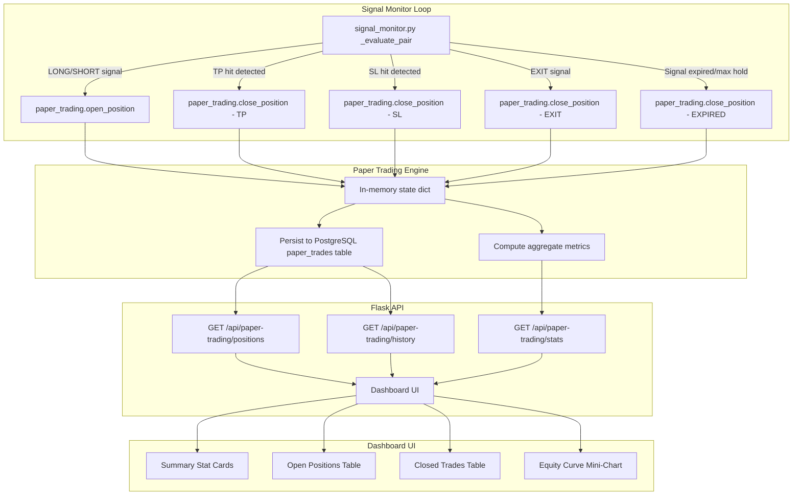

# Paper Trading System — Architecture & Implementation Plan

## 1. Overview

Implement an **automatic paper trading system** that:
- Opens simulated positions when the ML engine generates LONG/SHORT signals
- Closes positions when TP, SL, or EXIT conditions are triggered
- Replaces the current Price Performance Monitor (chart/candle section) with a comprehensive Paper Trading Dashboard
- Displays real-time metrics: Total PnL, Win Rate, Total Trades, Long vs Short Distribution, TP Hits, SL Hits

### Key Distinction from Existing Simulation

The current [`api_price_perf_v2`](protocol_96_ui.py:1932) is a **retrospective** simulation — it looks back at historical confidence data and estimates TP/SL using ATR multipliers. The new paper trading system is **prospective** — it opens positions in real-time as signals arrive and tracks them forward using the actual TP/SL levels from [`algo_scoring`](algo_scoring.py:34). This is fundamentally more accurate because:

- Uses actual TP1/TP2/TP3 and SL structure levels from the scoring engine
- Tracks positions across multiple evaluation cycles (not just within a single window)
- Respects signal stability gates and cooldowns
- Handles the full lifecycle: entry → TP1 partial → TP2 → TP3/SL/EXIT

---

## 2. Architecture Diagram



---

## 3. Data Model

### 3.1 PostgreSQL Table: `paper_trades`

```sql
CREATE TABLE IF NOT EXISTS paper_trades (
    id              UUID PRIMARY KEY DEFAULT gen_random_uuid(),
    symbol          VARCHAR(20) NOT NULL,
    direction       VARCHAR(10) NOT NULL,        -- LONG / SHORT
    status          VARCHAR(10) NOT NULL DEFAULT 'OPEN',  -- OPEN / CLOSED
    entry_price     NUMERIC NOT NULL,
    entry_ts        TIMESTAMPTZ NOT NULL DEFAULT NOW(),
    entry_conf      NUMERIC,                      -- ML confidence at entry (0-1)
    entry_ml_size   VARCHAR(10),                  -- FULL / HALF
    tp1_price       NUMERIC,                      -- TP1 level from algo_scoring
    tp2_price       NUMERIC,                      -- TP2 level
    tp3_price       NUMERIC,                      -- TP3 level
    sl_price        NUMERIC NOT NULL,             -- SL structure level
    exit_price      NUMERIC,
    exit_ts         TIMESTAMPTZ,
    exit_reason     VARCHAR(10),                  -- TP1 / TP2 / TP3 / SL / EXIT / EXPIRED / SIGNAL_FLIP
    pnl_pct         NUMERIC,                      -- PnL % after leverage & fees
    pnl_usdt        NUMERIC,                      -- PnL in USDT (capital * pnl_pct)
    hold_hours      NUMERIC,                      -- Duration in hours
    leverage        NUMERIC NOT NULL DEFAULT 3,
    fee_pct         NUMERIC DEFAULT 0.0008,       -- Total round-trip fee %
    created_at      TIMESTAMPTZ NOT NULL DEFAULT NOW(),
    updated_at      TIMESTAMPTZ NOT NULL DEFAULT NOW()
);

CREATE INDEX IF NOT EXISTS idx_paper_trades_symbol ON paper_trades (symbol);
CREATE INDEX IF NOT EXISTS idx_paper_trades_status ON paper_trades (status);
CREATE INDEX IF NOT EXISTS idx_paper_trades_entry_ts ON paper_trades (entry_ts DESC);
```

### 3.2 In-Memory State

A thread-safe dict `_paper_positions` keyed by symbol, mirroring open positions for fast reads:

```python
_paper_positions = {
    "SOLUSDT": {
        "id": "uuid...",
        "symbol": "SOLUSDT",
        "direction": "LONG",
        "entry_price": 145.20,
        "entry_ts": 1714396800.0,
        "entry_conf": 0.82,
        "entry_ml_size": "FULL",
        "tp1_price": 150.50,
        "tp2_price": 155.00,
        "tp3_price": 162.00,
        "sl_price": 141.00,
        "leverage": 3,
        "tp1_hit": False,
        "tp2_hit": False,
        "tp3_hit": False,
    },
    ...
}
```

---

## 4. Module Design: `paper_trading.py`

### 4.1 Core Functions

| Function | Purpose |
|----------|---------|
| `open_position(symbol, direction, entry_price, conf, ml_size, tp1, tp2, tp3, sl, leverage)` | Open a new paper trade. Closes any existing open position for the same symbol first (signal flip). Persists to DB. |
| `close_position(symbol, exit_price, exit_reason)` | Close the open position for a symbol. Calculate PnL, update DB, remove from in-memory state. |
| `get_open_positions()` | Return all open positions from in-memory cache. |
| `get_closed_trades(limit, symbol)` | Return closed trades from DB with pagination. |
| `get_stats()` | Compute aggregate metrics: total PnL, win rate, trade count, long/short distribution, TP hits, SL hits. |
| `check_tp_sl(symbol, high_price, low_price)` | Check if TP/SL levels are hit by current candle. Called by signal_monitor each cycle. |
| `reset_all()` | Clear all paper trades (for testing). |
| `load_open_positions()` | Load open positions from DB into memory on startup. |

### 4.2 PnL Calculation

```python
# For LONG:
pnl_raw = (exit_price - entry_price) / entry_price
# For SHORT:
pnl_raw = (entry_price - exit_price) / entry_price

# After leverage and fees:
pnl_pct = (pnl_raw * leverage - fee_pct) * 100
pnl_usdt = ALLOCATED_CAPITAL * pnl_pct / 100
```

### 4.3 TP/SL Check Logic (per evaluation cycle)

This mirrors the existing logic in [`_evaluate_pair`](signal_monitor.py:548) but for paper positions:

```python
def check_tp_sl(symbol, high_price, low_price):
    pos = _paper_positions.get(symbol)
    if not pos or pos["status"] != "OPEN":
        return None
    
    direction = pos["direction"]
    
    if direction == "LONG":
        if not pos["tp1_hit"] and high_price >= pos["tp1_price"]:
            # TP1 hit — partial close 30%, move SL to entry
            pos["tp1_hit"] = True
            return {"hit": "TP1", "price": pos["tp1_price"]}
        if not pos["tp2_hit"] and high_price >= pos["tp2_price"]:
            pos["tp2_hit"] = True
            return {"hit": "TP2", "price": pos["tp2_price"]}
        if not pos["tp3_hit"] and high_price >= pos["tp3_price"]:
            # TP3 — full close
            return {"hit": "TP3", "price": pos["tp3_price"], "full_close": True}
        if low_price <= pos["sl_price"]:
            # SL hit — full close
            return {"hit": "SL", "price": pos["sl_price"], "full_close": True}
    
    elif direction == "SHORT":
        if not pos["tp1_hit"] and low_price <= pos["tp1_price"]:
            pos["tp1_hit"] = True
            return {"hit": "TP1", "price": pos["tp1_price"]}
        # ... symmetric for SHORT
```

**Simplification for v1**: Instead of partial closes at TP1/TP2, we close the full position at the **first TP or SL hit**. This keeps the PnL calculation clean and the metrics straightforward. The exit_reason will be TP1/TP2/TP3/SL accordingly.

---

## 5. Integration with `signal_monitor.py`

### 5.1 Auto-Open on Signal

In [`_evaluate_pair`](signal_monitor.py:310), after a signal passes the stability gate and before sending the Telegram alert, call `paper_trading.open_position()`:

```python
# After line ~698 (LONG signal confirmed) and ~753 (SHORT signal confirmed)
import paper_trading

# For LONG signal:
paper_trading.open_position(
    symbol=symbol,
    direction="LONG",
    entry_price=close_price,
    conf=ml_conf_L,
    ml_size=ml_size_L,
    tp1=lvl_L['tp1'], tp2=lvl_L['tp2'], tp3=lvl_L['tp3'],
    sl=lvl_L['sl_structure'],
    leverage=3,  # from config
)

# For SHORT signal:
paper_trading.open_position(
    symbol=symbol,
    direction="SHORT",
    entry_price=close_price,
    conf=ml_conf_S,
    ml_size=ml_size_S,
    tp1=lvl_S['tp1'], tp2=lvl_S['tp2'], tp3=lvl_S['tp3'],
    sl=lvl_S['sl_structure'],
    leverage=3,
)
```

### 5.2 Auto-Close on TP/SL/EXIT

In the same `_evaluate_pair` function, **before** the existing TP/SL alert logic, add paper trading checks:

```python
# After fetching current candle high/low (line ~549)
paper_trading.check_tp_sl(symbol, high_price, low_price)
```

For EXIT signals and signal flips:
```python
# When hard_exits detected (line ~609):
paper_trading.close_position(symbol, close_price, "EXIT")

# When signal flips (new opposite signal opens, open_position handles auto-close of existing)
```

### 5.3 Max Hold Expiry

When the entry expires (line ~443-475), close the paper position:
```python
paper_trading.close_position(symbol, close_price, "EXPIRED")
```

---

## 6. API Endpoints

### 6.1 `GET /api/paper-trading/positions`
Returns all currently open paper positions.

```json
{
  "success": true,
  "positions": [
    {
      "id": "uuid",
      "symbol": "SOLUSDT",
      "direction": "LONG",
      "entry_price": 145.20,
      "entry_ts": "2026-04-29T10:00:00Z",
      "entry_conf": 0.82,
      "entry_ml_size": "FULL",
      "tp1_price": 150.50,
      "tp2_price": 155.00,
      "tp3_price": 162.00,
      "sl_price": 141.00,
      "leverage": 3,
      "current_price": 148.30,
      "floating_pnl_pct": 6.38,
      "floating_pnl_usdt": 12.76,
      "hold_hours": 4.5
    }
  ]
}
```

### 6.2 `GET /api/paper-trading/history`
Returns closed trades with pagination.

Query params: `?symbol=SOLUSDT&limit=50&offset=0`

### 6.3 `GET /api/paper-trading/stats`
Returns aggregate metrics for the dashboard.

```json
{
  "success": true,
  "stats": {
    "total_pnl_usdt": 127.45,
    "total_pnl_pct": 63.7,
    "win_rate": 58.3,
    "total_trades": 24,
    "long_count": 14,
    "short_count": 10,
    "tp_hits": 14,
    "sl_hits": 10,
    "avg_hold_hours": 18.5,
    "best_trade_pct": 15.2,
    "worst_trade_pct": -8.3,
    "open_positions": 3,
    "equity_curve": [
      {"ts": "2026-04-28T10:00:00Z", "cumulative_pnl": 0},
      {"ts": "2026-04-28T14:00:00Z", "cumulative_pnl": 12.5},
      ...
    ]
  }
}
```

### 6.4 `POST /api/paper-trading/reset`
Clears all paper trades (for testing). Requires confirmation param.

---

## 7. UI Design: Paper Trading Dashboard

### 7.1 Replace Target

The **Price Performance Monitor** section (lines 280-412 in [`dashboard.html`](templates/dashboard.html:280)) will be replaced. This section currently contains:
- Stat cards row (Valid Entry, LONG, SHORT, Weak, Win Rate, Total PnL, TP Hit, SL Hit)
- Chart.js canvas with candlestick bars + ML confidence line + TP/SL projections
- Legend

### 7.2 New Dashboard Layout

```
┌─────────────────────────────────────────────────────────────────┐
│ 📊 Paper Trading Dashboard — Simulasi Otomatis        [LIVE]   │
├─────────────────────────────────────────────────────────────────┤
│ ┌──────────┐ ┌──────────┐ ┌──────────┐ ┌──────────┐ ┌────────┐│
│ │Total PnL │ │ Win Rate │ │Total Trade│ │Long vs   │ │TP Hits ││
│ │ +$127.45 │ │  58.3%   │ │    24    │ │Short     │ │   14   ││
│ │ ▲ green  │ │ ▲ purple │ │ ▲ blue   │ │14L / 10S │ │ ▲ green││
│ └──────────┘ └──────────┘ └──────────┘ └──────────┘ └────────┘│
│ ┌──────────┐ ┌──────────┐ ┌──────────┐ ┌──────────┐           │
│ │ SL Hits  │ │ Best Trade│ │Worst Trade│ │Avg Hold │           │
│ │   10     │ │ +15.2%   │ │  -8.3%   │ │ 18.5h   │           │
│ │ ▲ red    │ │ ▲ green  │ │ ▲ red    │ │ ▲ gray  │           │
│ └──────────┘ └──────────┘ └──────────┘ └──────────┘           │
├─────────────────────────────────────────────────────────────────┤
│ 📈 Equity Curve (mini chart)                                    │
│ ┌─────────────────────────────────────────────────────────────┐ │
│ │  Chart.js line chart — cumulative PnL over time             │ │
│ └─────────────────────────────────────────────────────────────┘ │
├─────────────────────────────────────────────────────────────────┤
│ 🟢 Open Positions (3)                          [Auto-refresh]  │
│ ┌───────┬──────────┬─────────┬─────────┬──────┬──────────────┐│
│ │Symbol │Direction │Entry $  │Current $│PnL % │Hold Time     ││
│ ├───────┼──────────┼─────────┼─────────┼──────┼──────────────┤│
│ │SOL    │LONG FULL │$145.20  │$148.30  │+6.4% │4h 30m        ││
│ │DOGE   │SHORT HALF│$0.1240  │$0.1215  │+6.0% │2h 15m        ││
│ │ETH    │LONG FULL │$3240    │$3195    │-4.2% │6h 45m        ││
│ └───────┴──────────┴─────────┴─────────┴──────┴──────────────┘│
├─────────────────────────────────────────────────────────────────┤
│ 📋 Recent Closed Trades                         [View All]     │
│ ┌───────┬──────────┬─────────┬─────────┬──────┬──────────────┐│
│ │Symbol │Direction │Entry $  │Exit $   │PnL % │Exit Reason   ││
│ ├───────┼──────────┼─────────┼─────────┼──────┼──────────────┤│
│ │XRP    │LONG FULL │$2.15    │$2.28    │+18.1%│TP2 ✅        ││
│ │BNB    │SHORT HALF│$580     │$595     │-7.8% │SL 🔴         ││
│ │ADA    │LONG FULL │$0.45    │$0.48    │+20.0%│TP3 🚀       ││
│ └───────┴──────────┴─────────┴─────────┴──────┴──────────────┘│
└─────────────────────────────────────────────────────────────────┘
```

### 7.3 UI Behavior

- **Auto-refresh**: Poll `/api/paper-trading/positions` and `/api/paper-trading/stats` every 30 seconds
- **Flash animation**: When a new position opens or closes, highlight the row briefly
- **Color coding**: Green for profit/TP, red for loss/SL, purple for win rate
- **Floating PnL**: Open positions show real-time floating PnL based on current price from the main data fetch
- **Collapsible**: Section remains collapsible like the current Price Performance Monitor

---

## 8. File Changes Summary

| File | Change Type | Description |
|------|-------------|-------------|
| `paper_trading.py` | **NEW** | Paper trading engine — open/close positions, metrics, persistence |
| `signal_monitor.py` | **MODIFY** | Add hooks to call paper_trading on signal/TP/SL/EXIT/EXPIRED |
| `protocol_96_ui.py` | **MODIFY** | Add 4 API endpoints for paper trading |
| `db_init.sql` | **MODIFY** | Add `paper_trades` table DDL |
| `templates/dashboard.html` | **MODIFY** | Replace Price Performance Monitor section with Paper Trading Dashboard |
| `static/dashboard.js` | **MODIFY** | Add paper trading rendering, polling, and UI logic |

---

## 9. Implementation Order

1. **`db_init.sql`** — Add `paper_trades` table
2. **`paper_trading.py`** — Core engine with all functions
3. **`signal_monitor.py`** — Integration hooks
4. **`protocol_96_ui.py`** — API endpoints
5. **`templates/dashboard.html`** — New dashboard HTML structure
6. **`static/dashboard.js`** — Frontend rendering and polling

---

## 10. Fallback / No-DB Mode

If `DATABASE_URL` is not set (local development), paper trades will be stored in a local JSON file (`paper_trades.json`), similar to the existing fallback pattern in [`signal_monitor.py`](signal_monitor.py:147). The in-memory state always serves as the primary read source, with persistence being a write-through backup.

---

## 11. Thread Safety

The paper trading engine shares the same concurrency model as signal_monitor:
- All mutations go through `threading.Lock`
- In-memory state is the source of truth for reads
- DB writes are fire-and-forget with error logging
- UI reads from in-memory state via API (no DB query needed for open positions)
