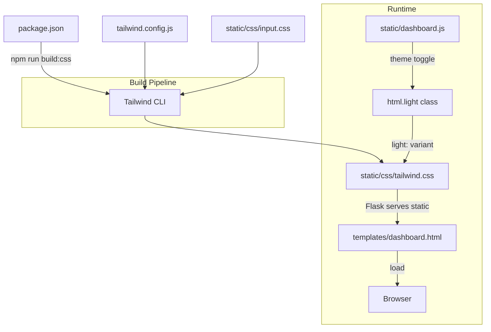

# Tailwind CSS Migration Plan — Protocol 9.6 Dashboard

## Overview

Migrate the existing Protocol 9.6 dashboard from ~700 lines of embedded custom CSS to pure Tailwind CSS utility classes. All UI sections will be converted while preserving visual fidelity, glassmorphism aesthetics, dark/light theme, and responsive layout.

## Architecture Decisions (Confirmed)

| Decision | Choice | Rationale |
|---|---|---|
| **Integration** | npm + Tailwind CLI | Production-ready, tree-shaking, smaller output, no runtime CDN dependency |
| **Glassmorphism** | Pure Tailwind arbitrary values | 100% utility classes, no custom `glass-*` component classes |
| **Theme system** | `light:` custom variant plugin | Pure Tailwind approach using class-based theme switching |
| **Build tool** | Tailwind CLI via npm script | Simple, no webpack/postcss needed |

---

## Phase 0: Tailwind Build Pipeline Setup

### Files to Create

#### [`package.json`](package.json)
```json
{
  "name": "swing-trade-dashboard",
  "version": "1.0.0",
  "private": true,
  "scripts": {
    "build:css": "tailwindcss -i ./static/css/input.css -o ./static/css/tailwind.css --minify",
    "watch:css": "tailwindcss -i ./static/css/input.css -o ./static/css/tailwind.css --watch"
  },
  "devDependencies": {
    "tailwindcss": "^3.4.17"
  }
}
```

#### [`tailwind.config.js`](tailwind.config.js)
The config will:
- Set `darkMode: 'class'` (but we'll use our own `light:` variant)
- Define custom colors mapped from current design tokens
- Add custom `light:` variant plugin
- Extend animations (fadeIn, slideUp)
- Configure content paths: `./templates/**/*.html`, `./static/**/*.js`

#### [`static/css/input.css`](static/css/input.css)
```css
@tailwind base;
@tailwind components;
@tailwind utilities;

@layer base {
  /* Base body styles that can't be done via utility classes */
  body {
    @apply antialiased min-h-screen;
    background-image:
      radial-gradient(ellipse 70% 50% at 15% 0%, rgba(99,125,255,0.06) 0%, transparent 55%),
      radial-gradient(ellipse 50% 40% at 85% 100%, rgba(167,139,250,0.05) 0%, transparent 55%);
    background-attachment: fixed;
  }
}
```

#### [`static/css/tailwind.css`](static/css/tailwind.css) (built output)
- Generated by `npm run build:css`
- Served as static file via Flask
- Referenced in [`templates/dashboard.html`](templates/dashboard.html) `<link>` tag

---

## Phase 1: Design Token Mapping → Tailwind Config

### Color Palette

| Token | Dark Value | Light Value | Tailwind Usage |
|---|---|---|---|
| `--bg-base` | `#0a0e1a` | `#eef2fa` | `bg-[#0a0e1a]` / `light:bg-[#eef2fa]` |
| `--bg-surface` | `#0f1424` | `#e2e8f4` | `bg-[#0f1424]` / `light:bg-[#e2e8f4]` |
| `--accent-blue` | `#637dff` | same | `text-[#637dff]` / `bg-[#637dff]` / `border-[#637dff]` |
| `--accent-cyan` | `#22d3ee` | same | `text-[#22d3ee]` |
| `--accent-green` | `#34d399` | same | `text-[#34d399]` / `bg-[#34d399]` |
| `--accent-red` | `#f87171` | same | `text-[#f87171]` / `bg-[#f87171]` |
| `--accent-yellow` | `#fbbf24` | same | `text-[#fbbf24]` |
| `--accent-purple` | `#a78bfa` | same | `text-[#a78bfa]` |
| `--accent-orange` | `#fb923c` | same | `text-[#fb923c]` |
| `--text-1` | `#e8ecf4` | `#0f172a` | `text-[#e8ecf4]` / `light:text-[#0f172a]` |
| `--text-2` | `#8b95ad` | `#475569` | `text-[#8b95ad]` / `light:text-[#475569]` |
| `--text-3` | `#5a6478` | `#94a3b8` | `text-[#5a6478]` / `light:text-[#94a3b8]` |

**Note**: Accent colors (blue, cyan, green, red, yellow, purple, orange) are the same in both themes, so no `light:` variant needed. Only `text-1`, `text-2`, `text-3`, `bg-base`, `bg-surface` change.

### Fonts
| Current | Tailwind |
|---|---|
| `Inter, system-ui, sans-serif` | `font-sans` (configure `fontFamily.sans` in config) |
| `JetBrains Mono, monospace` | `font-mono` (configure `fontFamily.mono` in config) |

### Border Radius
| Current | Tailwind |
|---|---|
| `--radius-sm: 10px` | `rounded-[10px]` |
| `--radius-md: 14px` | `rounded-[14px]` |
| `--radius-lg: 18px` | `rounded-[18px]` |
| `--radius-xl: 24px` | `rounded-[24px]` |

### Shadows
| Current | Tailwind |
|---|---|
| `--shadow-sm` | `shadow-[0_2px_12px_rgba(0,0,0,0.4)]` / `light:shadow-[0_2px_8px_rgba(0,0,0,0.06)]` |
| `--shadow-md` | `shadow-[0_8px_32px_rgba(0,0,0,0.5)]` / `light:shadow-[0_4px_20px_rgba(0,0,0,0.1)]` |
| `--glow-blue` | `shadow-[0_0_30px_rgba(99,125,255,0.12)]` |
| `--glow-green` | `shadow-[0_0_30px_rgba(52,211,153,0.12)]` |
| `--glow-red` | `shadow-[0_0_30px_rgba(248,113,113,0.12)]` |

---

## Phase 2: Tailwind Config Customizations

### [`tailwind.config.js`](tailwind.config.js) — Key Additions

```js
const plugin = require('tailwindcss/plugin');

module.exports = {
  content: ['./templates/**/*.html', './static/**/*.js'],
  theme: {
    extend: {
      fontFamily: {
        sans: ['Inter', 'system-ui', 'sans-serif'],
        mono: ['JetBrains Mono', 'monospace'],
      },
      keyframes: {
        fadeIn: {
          '0%': { opacity: '0', transform: 'translateY(-6px)' },
          '100%': { opacity: '1', transform: 'translateY(0)' },
        },
        slideUp: {
          '0%': { opacity: '0', transform: 'translateY(12px)' },
          '100%': { opacity: '1', transform: 'translateY(0)' },
        },
      },
      animation: {
        fadeIn: 'fadeIn 0.3s ease',
        slideUp: 'slideUp 0.4s ease backwards',
      },
    },
  },
  plugins: [
    plugin(function({ addVariant }) {
      // light: variant — .light class on html element
      addVariant('light', ':is(.light &)');
    }),
  ],
};
```

### Animation Classes Mapping

| Current | Tailwind Equivalent |
|---|---|
| `animation: pulse 2s ease infinite` | `animate-pulse` (built-in) |
| `animation: spin 1s linear infinite` | `animate-spin` (built-in) |
| `animation: fadeIn .3s ease` | `animate-fadeIn` (custom) |
| `animation: slideUp .4s ease backwards` | `animate-slideUp` (custom) |

---

## Phase 3: HTML Migration — Glassmorphism Patterns

### Common Glassmorphism Pattern (used ~30+ times)
```
Current:  class="glass"
New:      class="bg-white/[0.03] backdrop-blur-2xl border border-white/[0.08] rounded-[18px] shadow-[0_2px_12px_rgba(0,0,0,0.4)]"

Current:  class="glass-sm"
New:      class="bg-white/[0.03] backdrop-blur-[14px] border border-white/[0.08] rounded-[14px]"

Current:  class="glass-card"
New:      class="bg-white/[0.03] backdrop-blur-[12px] border border-white/[0.08] rounded-[16px] shadow-[0_8px_32px_rgba(0,0,0,0.4)]"

Current:  class="glass-input"
New:      class="bg-white/[0.05] backdrop-blur-sm border border-white/[0.08] rounded-[12px] px-3.5 py-2.5 text-sm text-[#e8ecf4] outline-none focus:border-[#637dff] focus:shadow-[0_0_0_3px_rgba(99,125,255,0.15)]"
```

---

## Phase 3: HTML Migration — Section-by-Section

### Phase 3a: Head, Meta, Fonts, Loading Overlay

**Head changes**:
- Add `<link rel="stylesheet" href="/static/css/tailwind.css">`
- Remove entire `<style>` block (lines 12-708)
- Remove Google Fonts link (Tailwind will bundle via config)

**Loading Overlay** (lines 713-716):
```
Current:
<div class="loading-overlay" id="loadingOverlay">
    <div class="spinner"></div>
    <div class="loading-text">Loading Protocol 9.6...</div>
</div>

New:
<div class="fixed inset-0 z-[9999] bg-[#0a0e1a]/92 backdrop-blur-2xl flex flex-col items-center justify-center transition-opacity duration-300 hidden-opacity-0 [&.hidden]:opacity-0 [&.hidden]:pointer-events-none" id="loadingOverlay">
    <div class="w-11 h-11 border-3 border-[#637dff]/20 border-t-[#637dff] rounded-full animate-spin"></div>
    <div class="mt-4 text-sm text-[#8b95ad]">Loading Protocol 9.6 · Quantitative Engine...</div>
</div>
```

> **Note**: The `.hidden` class behavior (opacity: 0, pointer-events: none) will need to be handled via JS adding/removing the class, similar to current behavior.

### Phase 3b: Floating Sticky Header (lines 720-746)

```
Current:
<div class="header-sticky-wrapper" id="floatingHeader">
    <header class="glass header" id="mainHeader">
        <div class="header-left">
            <div class="header-logo">⚡</div>
            <div>
                <div class="header-title">Protocol 9.6</div>
                <div class="header-sub">Structural Guardian · Swing Trade</div>
            </div>
        </div>
        <div class="header-right">
            ...buttons...
        </div>
    </header>
</div>

New:
<div class="fixed top-0 left-0 right-0 w-full z-[900] drop-shadow-[0_4px_20px_rgba(0,0,0,0.5)]" id="floatingHeader">
  <header class="flex items-center justify-between flex-wrap gap-2 px-4 py-2.5 bg-[rgba(10,14,26,0.90)] backdrop-blur-[30px] saturate-[1.8] shadow-[0_2px_20px_rgba(0,0,0,0.5)] rounded-b-[18px] border-b border-white/[0.08] light:bg-[rgba(238,242,250,0.92)]" id="mainHeader">
    <div class="flex items-center gap-3.5">
      <div class="w-11 h-11 rounded-[14px] bg-gradient-to-br from-[#637dff] to-[#22d3ee] flex items-center justify-center text-[22px] shadow-[0_0_30px_rgba(99,125,255,0.12)]">⚡</div>
      <div>
        <div class="text-[20px] font-bold tracking-tight text-[#e8ecf4] light:text-[#0f172a]">Protocol 9.6</div>
        <div class="text-[12px] text-[#5a6478] light:text-[#94a3b8] font-normal">Structural Guardian · Swing Trade</div>
      </div>
    </div>
    <div class="flex items-center gap-2.5 flex-wrap">
      ...buttons using Tailwind...
    </div>
  </header>
</div>
```

**Body padding compensation**: `body { padding-top: 72px; }` → `class="pt-[72px]"` on `<body>`

### Phase 3c: System Health Bar & Emergency Banner (lines 758-788)

System health bar uses `display: none` / `display: flex` via `.show` class.
```
New approach: Use JS toggling inline styles or a visible/hidden class.
```

### Phase 3d-3k: All remaining sections

Each section follows the same pattern:
1. Replace all `class="glass-card"` with the arbitrary value glass pattern
2. Replace all inline `style` attributes with Tailwind utility classes
3. Replace all custom CSS classes with Tailwind equivalents
4. Add `light:` variants for theme-dependent colors

---

## Phase 4: Theme System Migration

### Current Theme Toggle ([`dashboard.js`](static/dashboard.js:914))
```js
function toggleTheme() {
    const h = document.documentElement;
    const isDark = h.getAttribute('data-theme') === 'dark';
    h.setAttribute('data-theme', isDark ? 'light' : 'dark');
    localStorage.setItem('theme', isDark ? 'light' : 'dark');
}
```

### New Theme Toggle
```js
function toggleTheme() {
    const h = document.documentElement;
    const isDark = !h.classList.contains('light');
    h.classList.toggle('light', isDark); // light class = light mode
    localStorage.setItem('theme', isDark ? 'light' : 'dark');
}
```

- Dark mode = default (no class on `<html>`)
- Light mode = `<html class="light">`
- The custom `light:` variant plugin targets `.light &`

### Initial Theme Load
On page load, check localStorage and apply correct class:
```js
// Near top of inline <script>
const savedTheme = localStorage.getItem('theme');
if (savedTheme === 'light') {
    document.documentElement.classList.add('light');
}
```

---

## Phase 5: JavaScript Class Reference Updates

### Classes Referenced in [`dashboard.js`](static/dashboard.js)

| File:Line | Current Class | New Tailwind Classes |
|---|---|---|
| `dashboard.js:626` | `btn-loading` | `opacity-60 pointer-events-none` |
| `dashboard.js:916-917` | `data-theme` attr | `classList.toggle('light')` |
| `dashboard.js:951-1010` | `scanner-card`, `dec-long`, etc. | Arbitrary Tailwind classes in template literals |
| `dashboard.js:1077-1163` | Chart rendering | Update any class references |
| `dashboard.html:1126-1129` | `section-collapsible`, `collapsed`, `open` | Keep these classes or use Tailwind equivalents |

### Dynamic Content Generation
Functions like [`renderScannerCards()`](static/dashboard.js:951), [`renderQuantAnalysis()`](static/dashboard.js:204), [`renderStatusStrip()`](static/dashboard.js:53) generate HTML with template literals. These must all be updated to use Tailwind classes.

---

## Phase 6: Class Mapping Reference Table

### Layout & Structure

| Custom Class | Tailwind Replacement |
|---|---|
| `.app-container` | `max-w-[1520px] mx-auto px-[18px] py-3` |
| `.section` | `mb-3` |
| `.section-header` | `flex items-center gap-2.5 mb-2.5` |
| `.section-collapsible` | `cursor-pointer select-none rounded-[14px] p-2.5 -mx-1 -mt-1 mb-3.5 hover:bg-white/[0.02]` |
| `.section-collapsible.open .chevron` | `rotate-180` |
| `.section-body` | `max-h-[2000px] overflow-hidden transition-all duration-400 ease opacity-100` |
| `.section-body.collapsed` | `max-h-0 opacity-0 overflow-hidden` |
| `.chevron` | `ml-auto text-[11px] text-[#5a6478] inline-block transition-transform duration-300` |

### Status Strip

| Custom Class | Tailwind Replacement |
|---|---|
| `.status-strip` | `grid grid-cols-[repeat(auto-fit,minmax(130px,1fr))] gap-2 mb-3.5` |
| `.status-card` | `p-2.75 relative overflow-hidden animate-slideUp bg-white/[0.03] backdrop-blur-2xl border border-white/[0.08] rounded-[18px] shadow-[0_2px_12px_rgba(0,0,0,0.4)]` |
| `.status-card.accent-blue` | `border-t-2 border-t-[#637dff]` |
| `.status-card.accent-green` | `border-t-2 border-t-[#34d399]` |
| `.status-card.accent-red` | `border-t-2 border-t-[#f87171]` |
| `.status-card.accent-purple` | `border-t-2 border-t-[#a78bfa]` |
| `.status-card.accent-yellow` | `border-t-2 border-t-[#fbbf24]` |
| `.status-label` | `text-[9.5px] font-semibold text-[#5a6478] uppercase tracking-[0.8px] mb-1` |
| `.status-value` | `text-[18px] font-semibold leading-tight` |
| `.status-tag` | `inline-block text-[11px] font-semibold px-2.5 py-0.75 rounded-[10px] mt-1` |
| `.tag-active` | `bg-[#34d399]/14 text-[#34d399] border border-[#34d399]/28` |
| `.tag-killed` | `bg-[#f87171]/14 text-[#f87171] border border-[#f87171]/28` |
| `.val-pos` | `text-[#34d399]` |
| `.val-neg` | `text-[#f87171]` |
| `.val-warn` | `text-[#fbbf24]` |

### Buttons

| Custom Class | Tailwind Replacement |
|---|---|
| `.btn` | `inline-flex items-center justify-center gap-1.5 px-4.5 py-2.25 border border-white/[0.08] rounded-[22px] text-[13px] font-medium cursor-pointer bg-white/[0.03] text-[#e8ecf4] whitespace-nowrap hover:bg-white/[0.055] hover:border-white/[0.14] hover:-translate-y-0.5 transition-all duration-250` |
| `.btn-primary` | `bg-[#637dff] text-white border-[#637dff] hover:bg-[#4f6bef] hover:shadow-[0_0_30px_rgba(99,125,255,0.12)]` |
| `.btn-green` | `bg-[#34d399] text-[#0a0e1a] border-[#34d399] font-bold uppercase tracking-[0.5px] hover:bg-[#2cc48a] hover:shadow-[0_0_30px_rgba(52,211,153,0.12)]` |
| `.btn-icon` | `px-3 py-2.25 text-[16px]` |
| `.btn-loading` | `opacity-60 pointer-events-none` |

### Scanner Cards

| Custom Class | Tailwind Replacement |
|---|---|
| `#scannerGrid` | `grid grid-cols-[repeat(auto-fill,minmax(340px,1fr))] gap-3 p-1` |
| `.scanner-card` | `bg-white/[0.03] border border-white/[0.08] rounded-[14px] p-3.5 flex flex-col gap-2.5 relative overflow-hidden hover:bg-white/[0.055] hover:shadow-[0_2px_12px_rgba(0,0,0,0.4)] hover:-translate-y-0.5 transition-all duration-250` |
| `.scanner-card.dec-long` | `border-l-3 border-l-[#34d399]` |
| `.scanner-card.dec-short` | `border-l-3 border-l-[#f87171]` |
| `.scanner-card.dec-wait` | `border-l-3 border-l-[#5a6478]` |
| `.sc-header` | `flex items-center justify-between gap-2.5` |
| `.sc-pair` | `font-bold text-[14px] text-[#e8ecf4] tracking-tight` |
| `.sc-price` | `font-mono text-[12px] text-[#8b95ad]` |
| `.sc-decision` | `inline-flex items-center gap-2 px-3.5 py-1.75 rounded-[10px] border border-transparent` |
| `.sc-dec-label` | `font-extrabold text-[15px] tracking-[0.3px]` |
| `.sc-dec-sub` | `text-[10.5px] font-mono opacity-70 mt-0.25` |
| `.sc-size-pill` | `text-[9.5px] font-bold px-2 py-0.5 rounded-[8px] border border-current opacity-85 tracking-[0.4px] uppercase` |

### Quant Analysis

| Custom Class | Tailwind Replacement |
|---|---|
| `.quant-grid` | `grid grid-cols-2 gap-3.5 max-md:grid-cols-1` |
| `.narrative-grid` | `grid grid-cols-[1.6fr_1fr] gap-3.5 max-md:grid-cols-1` |
| `.quant-card` | `p-3.5 bg-white/[0.03] backdrop-blur-[12px] border border-white/[0.08] rounded-[16px] shadow-[0_8px_32px_rgba(0,0,0,0.4)]` |
| `.quant-decision-banner` | `p-3.5 rounded-[18px] text-center mb-3 border relative overflow-hidden` |
| `.decision-FULL` | `bg-[#34d399]/8 border-[#34d399]/30` |
| `.decision-HALF` | `bg-[#637dff]/8 border-[#637dff]/30` |
| `.decision-WAIT` | `bg-[#fbbf24]/8 border-[#fbbf24]/30` |
| `.decision-SKIP` | `bg-[#f87171]/8 border-[#f87171]/30` |
| `.decision-label` | `text-[10.5px] uppercase tracking-[2.5px] text-[#5a6478] mb-1.5` |
| `.decision-name` | `text-[22px] font-extrabold tracking-tight mb-1` |
| `.decision-score` | `text-[13px] font-medium opacity-80` |

### Modals & Forms

| Custom Class | Tailwind Replacement |
|---|---|
| `.modal-overlay` | `fixed inset-0 bg-black/55 backdrop-blur-[14px] hidden items-center justify-center z-[2000]` |
| `.modal-overlay.show` | `flex animate-fadeIn` |
| `.modal` | `bg-[#0f1424] border border-white/[0.08] rounded-[24px] p-7 w-[90%] max-w-[520px] max-h-[88vh] overflow-y-auto shadow-[0_8px_32px_rgba(0,0,0,0.5),0_0_60px_rgba(0,0,0,0.4)] light:bg-[#e2e8f4]` |
| `.modal-header` | `flex items-center justify-between mb-5` |
| `.modal-title` | `text-[18px] font-bold` |
| `.form-label` | `text-[12px] font-semibold text-[#5a6478] uppercase tracking-[0.6px]` |
| `.form-row` | `grid grid-cols-2 gap-3.5 max-md:grid-cols-1` |
| `.form-group` | `flex flex-col gap-1.5 w-full` |

### Perf Monitor

| Custom Class | Tailwind Replacement |
|---|---|
| `.perf-stat-grid` | `grid grid-cols-[repeat(auto-fit,minmax(110px,1fr))] gap-[7px] mb-3` |
| `.perf-stat-card` | `bg-white/[0.04] border border-white/[0.08] rounded-[14px] p-2.5 text-center backdrop-blur-[8px]` |
| `.perf-stat-label` | `text-[10px] text-[#8b95ad] mb-1 uppercase tracking-[0.5px]` |
| `.perf-stat-value` | `text-[17px] font-bold font-mono` |
| `.perf-stat-value.green` | `text-[#34d399]` |
| `.perf-stat-value.red` | `text-[#f87171]` |
| `.perf-stat-value.blue` | `text-[#637dff]` |

### Tables

| Custom Class | Tailwind Replacement |
|---|---|
| `.data-card` | `bg-white/[0.03] backdrop-blur-[12px] border border-white/[0.08] rounded-[16px] shadow-[0_8px_32px_rgba(0,0,0,0.4)] overflow-hidden` |
| `.table-scroll` | `overflow-x-auto overscroll-x-contain` |
| `table` | `w-full border-collapse text-[12.5px]` |
| `thead th` | `sticky top-0 bg-[#0f1424]/92 backdrop-blur-[8px] text-[#5a6478] font-semibold text-[10.5px] uppercase tracking-[0.6px] px-3.5 py-3 text-right border-b border-white/[0.08] whitespace-nowrap first:text-left` |
| `tbody td` | `px-3.5 py-2.75 font-mono text-[12px] text-[#e8ecf4] text-right border-b border-white/[0.03] whitespace-nowrap first:text-left first:font-sans first:text-[#5a6478]` |
| `tbody tr:hover` | `hover:bg-white/[0.055]` |
| `.row-bullish` | `bg-[#34d399]/6` |
| `.row-bearish` | `bg-[#f87171]/6` |
| `.row-neutral` | `bg-[#fbbf24]/4` |

### Panels

| Custom Class | Tailwind Replacement |
|---|---|
| `.panel-grid` | `grid grid-cols-[repeat(auto-fit,minmax(320px,1fr))] gap-3.5` |
| `.panel` | `p-3.5 bg-white/[0.03] backdrop-blur-2xl border border-white/[0.08] rounded-[18px] shadow-[0_2px_12px_rgba(0,0,0,0.4)]` |
| `.panel-title` | `text-[11px] font-semibold text-[#8b95ad] flex items-center gap-1.5 mb-2.5 uppercase tracking-[0.7px]` |
| `.panel-row` | `flex justify-between items-center py-1.5 border-b border-white/[0.035] last:border-b-0` |

### Responsive Breakpoints

| Current | Tailwind Equivalent |
|---|---|
| `@media(max-width: 900px) .quant-grid` | `max-lg:grid-cols-1` |
| `@media(max-width: 768px) .app-container` | `max-md:px-3.5` |
| `@media(max-width: 768px) .header` | `max-md:flex-col max-md:items-start` |
| `@media(max-width: 768px) .status-strip` | `max-md:grid-cols-2` |
| `@media(max-width: 768px) .panel-grid` | `max-md:grid-cols-1` |
| `@media(max-width: 768px) .form-row` | `max-md:grid-cols-1` |

---

## Phase 7: Print Styles (line 707)

Current: `@media print { .btn, .tabs, .loading-overlay, .alert-banner, .modal-overlay { display: none !important; } }`

Tailwind equivalent: Use `print:hidden` on those elements.

---

## Files to Modify

| File | Changes |
|---|---|
| [`templates/dashboard.html`](templates/dashboard.html) | Remove `<style>` block (lines 12-708), add tailwind.css link, convert all HTML classes to Tailwind, update inline `<script>` toggleSection function, add theme init script |
| [`static/dashboard.js`](static/dashboard.js) | Update `toggleTheme()` to use classList, update all template literal HTML to use Tailwind classes, update any CSS class references |
| [`static/css/input.css`](static/css/input.css) | NEW — Tailwind input with base styles |
| [`static/css/tailwind.css`](static/css/tailwind.css) | NEW — Built output (gitignored) |
| [`tailwind.config.js`](tailwind.config.js) | NEW — Tailwind configuration with light variant plugin and custom animations |
| [`package.json`](package.json) | NEW — npm config with build scripts |
| [`.gitignore`](.gitignore) | Add `node_modules/` and `static/css/tailwind.css` |

---

## Architecture Diagram



---

## Migration Order

The recommended execution order to minimize downtime and ensure testability:

1. **Setup build pipeline** (Phase 0) — npm init, install tailwind, create config, verify build works
2. **Create CSS foundation** (Phase 1-2) — input.css with base styles, tailwind.config.js with all customizations
3. **Migrate static elements first** — Head, header, loading overlay (Phase 3a-3b)
4. **Migrate theme system** (Phase 4) — Update toggleTheme(), add light variant
5. **Migrate remaining sections** (Phase 3c-3k) — One section at a time, testing each
6. **Update JavaScript** (Phase 5) — Update dashboard.js template literals
7. **Remove old CSS** (Phase 6) — Remove `<style>` block, verify build
8. **Final testing** (Phase 7) — Test all themes, responsive breakpoints, PDF export, all interactions

---

## Potential Risks & Mitigations

| Risk | Mitigation |
|---|---|
| **Layout shifts** during migration | Migrate section by section, test visually after each |
| **Theme colors mismatch** | Reference the color mapping table, use `light:` variant consistently |
| **JavaScript-generated HTML** needs updating | Update [`dashboard.js`](static/dashboard.js) template literals systematically |
| **PDF export may look different** | Test [`downloadPDF()`](static/dashboard.js:623) output, adjust print styles |
| **Arbitrary values verbosity** makes HTML hard to read | Use consistent class ordering convention: glass-bg → border → shadow → spacing → typography |
| **Performance with many arbitrary values** | Tailwind JIT only generates used classes — no bloat |
